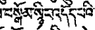
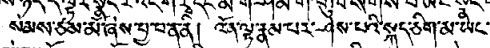
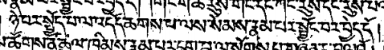

# Interesting passages

- (་་་)སྙིང་འདོད་པ།
     
    
    page: [line 6](https://www.tbrc.org/browser/ImageService?work=W23703&igroup=1525&image=537&first=532&last=538&fetchimg=yes)
    
    work : [མི་སྡུག་པའི་སྒོ་ནས་སེམས་གནས་པའི་ཐབས།](https://www.tbrc.org/?locale=bo#library_work_ViewByOutline-O1GS60111GS36633%7CW23703)
    
    edition: [སྡེ་དགེ་བསྟན་འགྱུར།](https://www.tbrc.org/?locale=bo#!rid=W23703)
    
- འོ་ན་ལྟ་(་་་)
    
    
     
    page: [line 6](https://www.tbrc.org/browser/ImageService?work=W23703&igroup=1524&image=428&first=428&last=457&fetchimg=yes) 
    
    work: [ལྟ་བའི་ཁྱད་པར།](https://www.tbrc.org/?locale=bo#library_work_ViewByOutline-O1GS60111GS36624%7CW23703)
    
    note: འོ་ན། ད་(་་་) would be expected instead – given this is indeed the same expression.
    
- iii
     
    
    page: [line 7](https://www.tbrc.org/browser/ImageService?work=W23703&igroup=1525&image=534&first=532&last=538&fetchimg=yes)
    
    work : [མི་སྡུག་པའི་སྒོ་ནས་སེམས་གནས་པའི་ཐབས།](https://www.tbrc.org/?locale=bo#library_work_ViewByOutline-O1GS60111GS36633%7CW23703)
    
    edition: [སྡེ་དགེ་བསྟན་འགྱུར།](https://www.tbrc.org/?locale=bo#!rid=W23703) 
    
    note: པ་ not expected after the noun འདོད་ཆགས་. This seems to show that འདོད་ and ཆགས་ seem to be taken as independent verbs.
    It seems to show that the Tibetan language at the time of writing had already synthetized something like འདོད་པ་དང་ཆགས་པ་, 
    yet didn't reach the point of gluing the two verbs into a noun, the modern འདོད་ཆགས་.
    
    
# Interesting works

- [ལྟ་བའི་ཁྱད་པར།](https://www.tbrc.org/?locale=bo#library_work_ViewByOutline-O1GS60111GS36624%7CW23703)

  This work is still smeared with the smell of India. It shows a similarity with Mipham's presentation of Madhyamika
  in terms of wording and content.
  
  It states in the introduction to be memory notes of what the author heard from Khenpos (most likely indian panditas) 
  and from his readings.
  
  The author speaks of མདོ་སྡེ་པའི་དབུ་མ་པ་ and རྣལ་འབྱོར་སྤྱོད་པའི་དབུ་མ་པ་. He cites two texts of interest from Shantarakshita, while saying 
  དབུ་མའི་སྣང་བ་'s presentation of the relative is slightly different from Shantarakshita's.
  